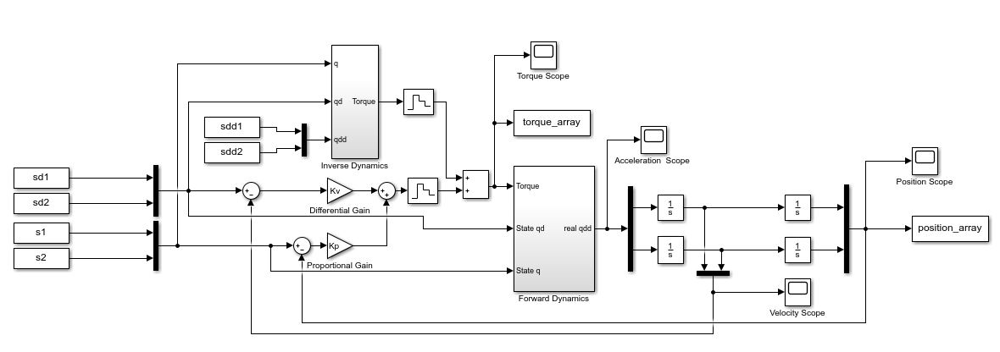
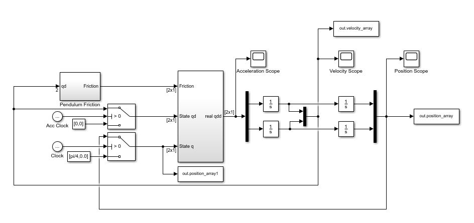

# Two Link Manipulator

## General Info 

This project includes a number of related functions which model the state and applied torque of each of the links of a two link manipualtor.

The project comprises a number of solvers implemented in MATLAB code and Simulink models: 

- Trapezoidal trajectory planner which calculates link positions, velocities and accelerations for a set maximum acceleration and velocity
- Feedforward torque control model in simulink
- Modelling a two link pendulum in Simulink (no applied torque) 

## Technology 
Software required 
- MATLAB/Simulink 2019b 

## Setup 
Start by cloning the git repository from address: 

"https://github.com/MajedYassin/TwoLink_Manipulator-.git"

In order to run/test the Feedforward torque control model in Simulink: 

- Run 'TL_trajectory.m', the trapezoidal trajectory solver

- Run 'TL_initialise_parameters.m' to set the initial parameters for the manipulator model 

- Set stop time and time step

- Run "Twolink_torquecontrol.slx"

  
  
 
  <b> Figure 2: Feedforward Torque Control Model</b> 

***Note: The timestep in the trajectory modeule and both Simulink models has been set to 0.01, 
  please remember to adjust this value accordingly when changing the timestep in the TL_trajectory.m code;***
  
Pendulum model: 

The Pendulum model simulates the motion of a two link manipulator when the link motors are disengaged and links allowed to fall, effectively turning the manipulator into a two link pendulum. The component of friction is added to the model's dynamics to replicate the energy loss due to friction. 

To Run the pendulum model set the desired initial joint angles of the links in the Simulink model, in the constant block labelled q. 

  
  
 
  <b> Figure 2: Pendulum Model </b> 

